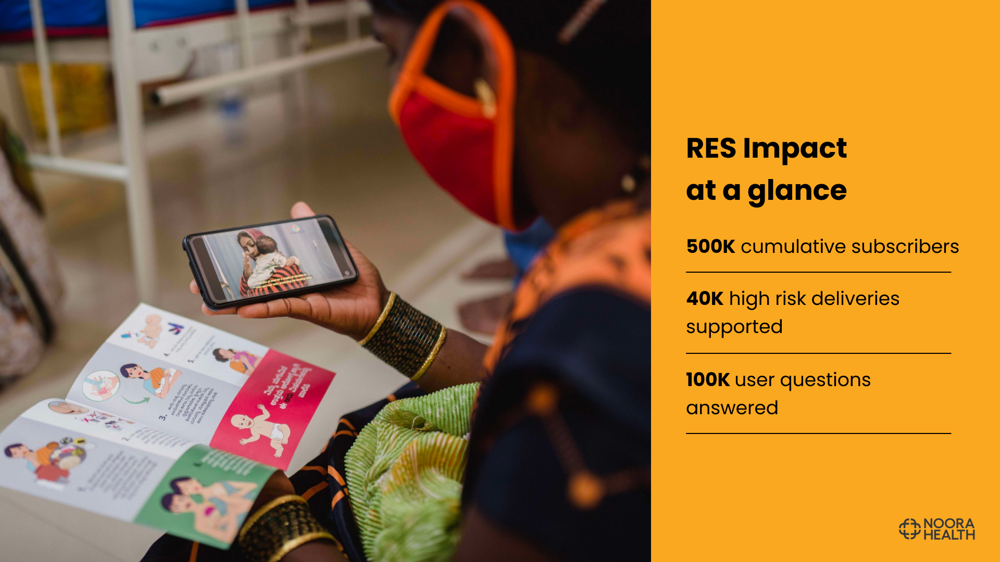

# Start Here

This is a free, open source project by Noora Health. This has two main components: an intent-recognition system  and an assistant platform for the medical support executives to provide health information to the patients/caregivers.

### What do we do?

RES is a mobile-based messaging service for patients and caregivers that empowers them towards healthy behaviors through in-time reminders and personalized support. RES is delivered through WhatsApp (scheduled messages, chatbot, and live chat), Voice (IVRS), or Teletrainers (live calls). We encourage patients and caregivers to ask us questions through these modalities and have a team of nurses and doctors to support this two-way communication platform.

### Key Features

Snapshot of RES on WhatsApp
Live support: Patients and caregivers can engage and ask specific
questions on WhatsApp 7am-9pm, 6 days a wee£

Rich media: Messages include engaging text, visual aids, and short-
form videos to improve information retention through behavior change communication method©

Health topics: Messages include high-impact behaviors. (Including healthy practices and appropriate healthcare seeking that are customized to a user’s condition, stage, and need.)

Universal usage: All users irrespective of the technology they use (smartphone or basic phone) can access RES in their language and modality of preference

<!--  -->

## Vision
(To be filled)

### Enhanced Query Processing

The goal is to develop a workflow that leverages a Large Language Model (LLM) to translate queries into English and accurately extract medical information from sources like medpalm2 or a validated medical question bank. The workflow entails:

- Generating an embedding from the cleaned Frequently Asked Questions (FAQ) database.
- Translating the user's query into English by:
- Detecting the query's original language and noting it as language. 

If the query isn't in English, translating the message to English; otherwise, proceeding with the message as is.

### Retrieving Medical Answers

-Utilizing RAG (Retrieval-Augmented Generation) to derive a generated answer, displaying the top three retrievals based on the translated query. Should there be no relevant answer, the system will indicate "out of context."
- Employing Medpalm2 to secure a precise answer to the medical query, then translating this answer back into the initially recorded language for user comprehension.

Translate the answer to the saved language field and output the answer.

Priority Medium:
- If a message’s input and output language is given:
- 1) Translate with AI 4 bharat’s transliteration and translation apis.

### Feedback Mechanisms

- Interface: Introduce a feedback interface post-answer with thumbs up (👍) or thumbs down (👎) icons and an optional text box for comments.
- Process: Collect and store feedback alongside the user's query, its translation, and the response for performance analysis and improvements.
- Implement a feature allowing users to specify their expected answer in a text box when no response is generated or if the provided answer is incorrect.

### Logging System

Query Logging: Record the original query, its detected language, and the translated English query. If a response is translated back, log both versions.

- Retrieval and Response: Log the retrieval process details, source selection rationale, and the provided answer.
- Feedback: Document the user's feedback (rating and comments) linked to the query and response.

<!--  -->

